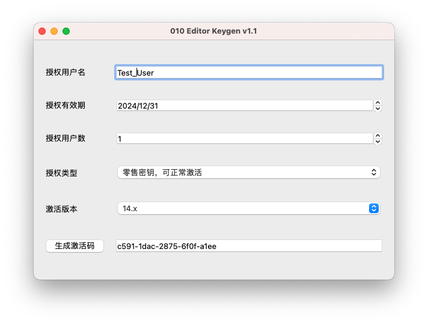
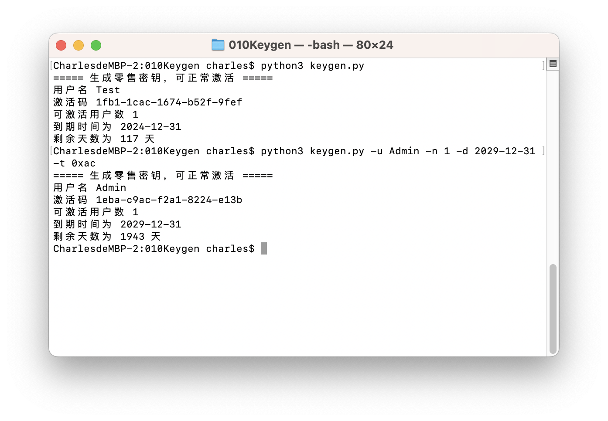

# 010 Editor Key Generator

## 说明

* 支持 010 Editor 10.x - 15.x 版本激活码的生成
* 相关代码基于 Python 3.9，暂不支持 Python 2
* GUI 部分基于 PyQt5 ，界面是自己瞎画的
* 激活流程及注册码生成过程参考 [[原创] 逆向分析010editor](https://bbs.kanxue.com/thread-261290.htm) 文章
* 注册码生成的核心流程见 `keygen.py` ，其余部分为 GUI 相关代码
* 激活前需参照 `4.去掉网络验证(V2)` 章节，屏蔽联网验证
* 本项目仅用于二进制逆向技术的学习及验证使用，请勿用于非法用途

## 使用方式

### GUI 方式

```shell
# 安装 PyQt5 图形库
python3 -m pip install pyqt5
# 克隆项目到本地
git clone https://github.com/garfield-ts/010Keygen.git
# 启动注册机
cd 010Keygen && python3 main.py
```

#### 工具截图

 

### 命令行方式

```shell
# 克隆项目到本地
git clone https://github.com/garfield-ts/010Keygen.git
cd 010Keygen
# 生成注册码信息
python3 keygen.py
# 指定注册码参数
python3 keygen.py -u Admin -n 1 -d 2029-12-31 -t 0xac
```

#### 工具截图



## TODO

* 集成联网验证屏蔽功能
* ……
